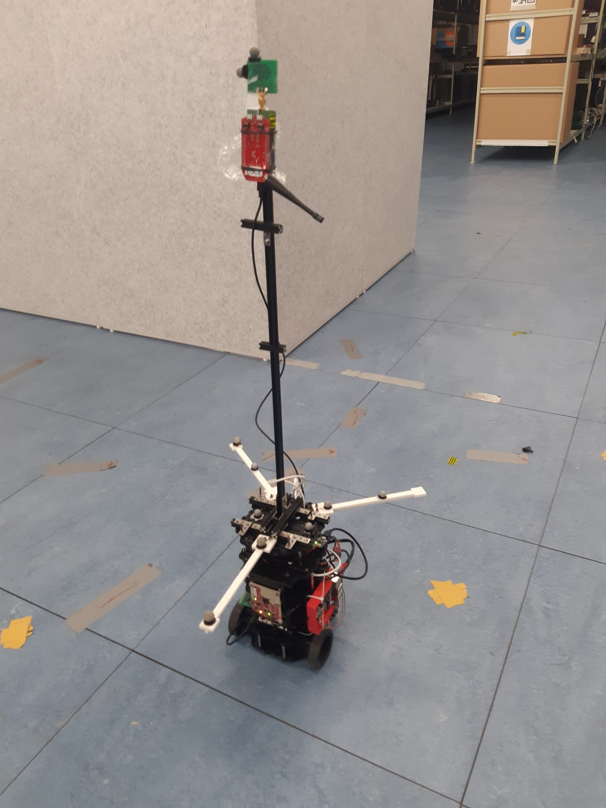

Welcome to IDLAB TURTLEBOT's documentation!
===================================

Check out the :doc:`mocapcontrol` section to start controlling the turtlebot through the mocap. 
For UWB exeperimental procedures please refer to :doc:`uwbexp`. To control the turtlebot please refer to the :ref:`turtlebotRC` section in the :doc:`turtlebot`. 

  
  
.. note::

   This project is under active development.

Contents
--------

.. toctree::

   mocapcontrol
   turtlebot
   uwbexp
   rosdock
   
