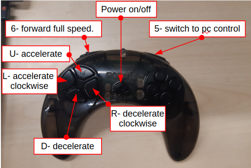

.. _Turtlebot:

Turtlebot
=========

In this section the basics are covered to operate the turtelbot for the experiments. 
In case more detail is need please visit: https://emanual.robotis.com/docs/en/platform/turtlebot3/overview/ .

Battery warning
---------------
.. warning::
	When the battery level is to low the turtlebot will stop and start to beep. 
	In this case it is important to close off the turtlebot and change the battery as soon as possible. 

	Never charge the battery while still connected to the robot in operation!!

Starting the Turtlebot
----------------------
Before to switch on the turtlebot disconnect the UWB tag. (a udev rule has to be made). 
Connect the battery to the robot and switch on the main powerswitch.

Connect to the turtlebot through ssh (Be carefull IP adress might change since it is not a fixed one.) : 

.. code-block:: console

   $ ssh ubuntu@10.10.135.10

Use the password: turtlebot

It can take a bit of time. In case you are worrying you can keep an eye on the ping: 

.. code-block:: console

   $ ping 10.10.135.10
   
Run the following command on the turtlebot to setup all the systems: 

.. code-block:: console

   $ roslaunch turtlebot3_bringup turtlebot3_robot.launch
   
Use ctrl + c to close the ros session.

to reboot use: 

.. code-block:: console

   $ sudo reboot
   
It might take some time for the robot to reboot. Once the robot has rebooted connect with it through ssh. 

Closing an the Turtlebot
------------------------
type ctrl + c to close the ros session

To shut down the turtelbot use: 

.. code-block:: console

   $ sudo poweroff
   
once the turtlebot is closed the main powerswitch can be switched off. 

Changing the battery
--------------------

Make sure the robot is fully switched of. Detacht the T-connector of the battery and remove the battery from the robot. Insert the new battery in the robot and connect it with the T-connector to the robot. The empty battety can be recharged using the charging station of the battery. 

.. _turtlebotRC:

Remote Control Operation
------------------------

The turlebot has been equiped with a remote control working on Bleutooth. 
In order to start the remote control operations it suffices to power on the remote control and press any of the buttons (except number 5.) 

In order to increase forward speed press the U-button, decrease speed press the D-button. (Warning: When the robot is moving backwards it has the tendency to become unstable and possibly topple.)
In order to increase clockwise rotation (decrease counterclockwise rotation) speed press the L-button, to decrease it press the R-button. 

Press the 6-button to make to robot move straightforward at topspeed. 

Press the 5-button to switch back to PC-controlled movement. 

 
.. note::
	It is sufficient to start up the turtlebot and directly control the trutlebot with the RC to move the robot arround without having to login to the turtlebot by ssh and starting the rosnode, since the RC acts directly on the microcontroller board (OpenRC). However in case you want to get all the sensor information and commands that have been send to the robot starting the rosnode will have to be performed. 
ROS topics
----------

